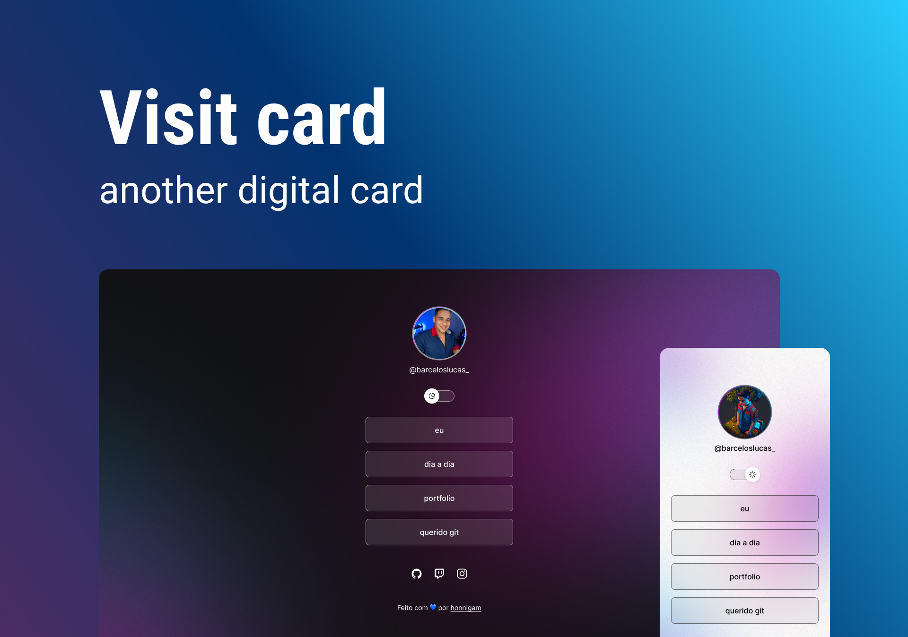

<h1 align="center"> Visit card mobile and web</h1>

this is a cartão de visita para meu portfólio e mostrando minha capacidade

  <a href="#-tecnologias">Tecnologias</a>&nbsp;&nbsp;&nbsp;|&nbsp;&nbsp;&nbsp;
  <a href="#-projeto">Projeto</a>&nbsp;&nbsp;&nbsp;|&nbsp;&nbsp;&nbsp;
  <a href="#memo-licença">Licença</a>

  

 

  

## 🚀 Tecnologias

Esse projeto foi desenvolvido com as seguintes tecnologias:

- HTML e CSS
- JavaScript
- Git e Github
- Figma

## 💻 Projeto

- esse é um simples cartão de visita criado para facilitar a comunicação entre às pessoas

## :memo: Licença

Esse projeto está sob a licença MIT.

---

Feito com 💙 por [honnigam](https://github.com/honnigam)
